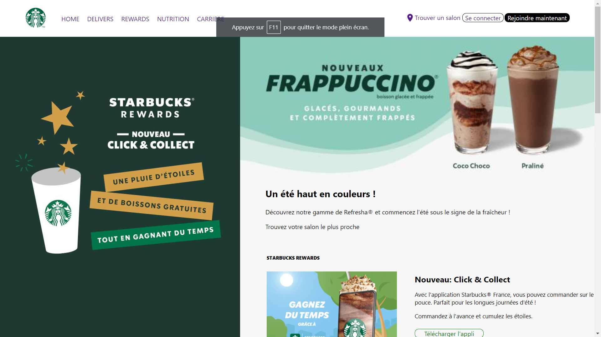
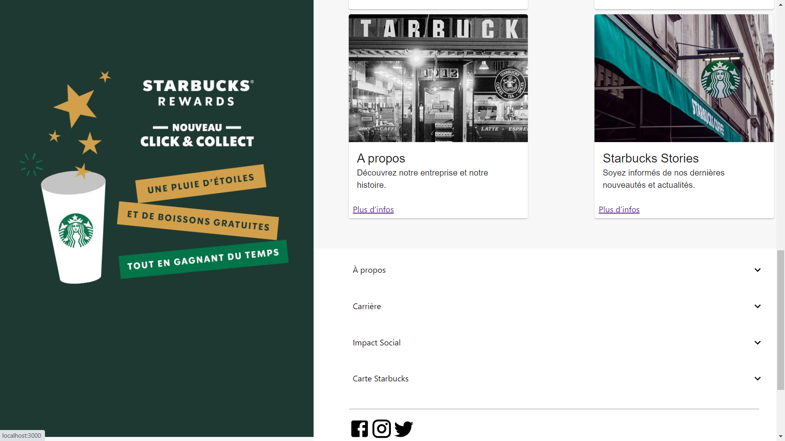

This project was bootstrapped with [Create React App](https://github.com/facebook/create-react-app), using the [Redux](https://redux.js.org/) and [Redux Toolkit](https://redux-toolkit.js.org/) template.

## Available Scripts

In the project directory, you can run:

### `npm start`

Runs the app in the development mode. 
Open [http://localhost:3000](http://localhost:3000) to view it in the browser.

The page will reload if you make edits. 
You will also see any lint errors in the console.

### `npm test`

Launches the test runner in the interactive watch mode. 
See the section about [running tests](https://facebook.github.io/create-react-app/docs/running-tests) for more information.

## How it's looks alike :

## About this testing copy of a web side

**Firstable:
I didn't realy finish the copy of the web site , i miss some few thing in it. 

**secondable:
I use in for this : material UI for the CSS , Reactjs and material UI icons.

Who can install it , by using yarn or npm it doesn't matter :
`npm install @material-ui/core ` ,`npm install @material-ui/icons` , if you're using `yarn` just put `yarn add` instead of `nom install`.
you can also fork the project and modify it.

## Learn More
To learn React, check out the [Material UI Documentation](https://material-ui.com/getting-started/installation/).
To learn React, check out the [React documentation](https://reactjs.org/).
